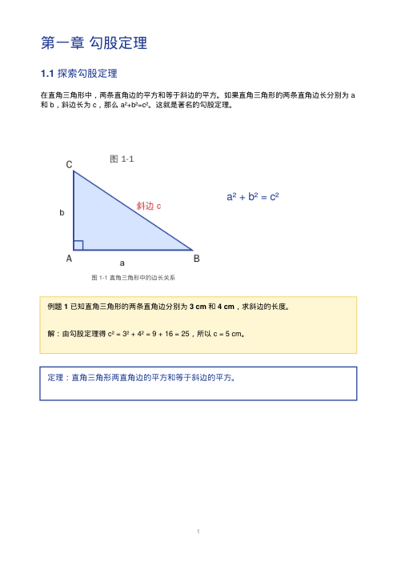
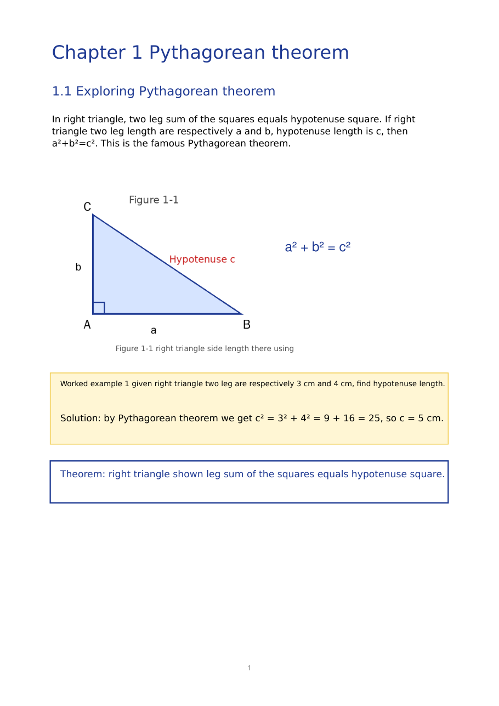
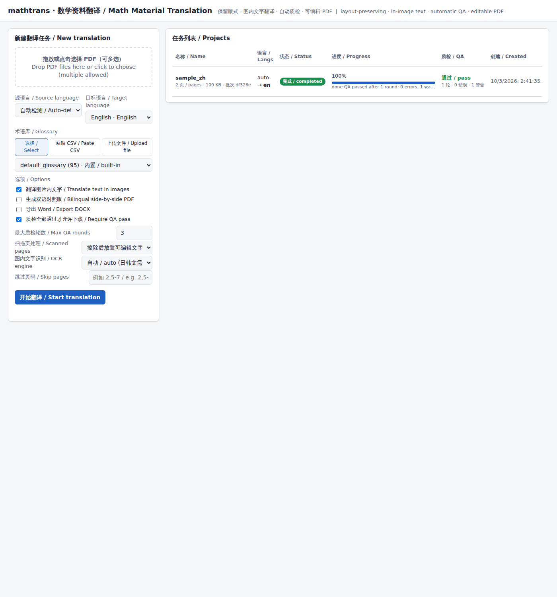

# mathtrans — 数学学习资料翻译系统

[English README](README.md)

保留原版式的多语种数学教材 PDF 翻译服务：上传彩色图文 PDF，选择目标语言，系统把页面上**所有文字（包括图片里嵌入的文字）**替换为译文，保持原始页面布局、图片位置和整体样式不变，经过**多维度自动质检**全部通过后，输出**可编辑 PDF**（可选 Word、双语对照版）。

Layout-preserving translation of math learning materials (PDF) between **Chinese, English, Portuguese, Spanish, Japanese and Korean**, including text embedded in raster images, with an editable PDF as output and a mandatory multi-round automatic QA loop before anything is exported.

---

## 效果示例 / Example

| 原文（中文教材，第 1 页） | 译文（英文，版式/图片/图内文字保持） |
|---|---|
|  |  |

Web 界面（中英双语）：



> 示例由内置的离线 mock 翻译器生成（仅用于演示流程，译文为逐词替换）；配置 `ANTHROPIC_API_KEY` 后由 Claude 完成真正的翻译与审校；配置 `DEEPSEEK_API_KEY` 则由 DeepSeek 完成。

---

## 功能对照 / Feature matrix

| 需求 | 状态 | 实现 |
|---|---|---|
| 源文件上传（中/英/葡/西/日/韩） | ✅ | Web 上传 / REST / CLI；源语言可自动检测 (`languages.detect_language`) |
| 目标语言自由选择 | ✅ | 六种语言任意组合（源 ≠ 目标） |
| 版式与图文保持不变 | ✅ | 只擦除原文字对象（`PyMuPDF` 文本遮盖，图片、线条、底色全部保留），译文按原字号/颜色/粗细/对齐重新排入原文本框，放不下时自动缩放、放宽行距或向空白区扩展；带框线的表格按线条识别后逐个单元格翻译（译文不越出单元格），同一行并排的文字（页眉 + 页码、无框线表格的一行）分段保留在原位 |
| 图片内嵌文字翻译 | ✅ | RapidOCR（离线）或 Claude 视觉识别图片内文字 → 翻译 → 背景填充/修复 → 用目标语言字体重绘 → 替换图片对象（像素尺寸、位置不变） |
| 可编辑 PDF | ✅ | 译文是真实文本对象（内嵌字体），可在 Acrobat / Illustrator 等工具中直接修改 |
| 自动质检（硬性要求） | ✅ | 10 项规则校验 + Claude 语义审校 + 版式校验 + 输出文件校验，多轮循环（失败段落带反馈重译），全部通过才输出；未通过的任务会被标记为 `qa_failed`，默认不允许下载 |
| 批量上传 | ✅ | 一次上传多个 PDF，自动生成同一 `batch_id` 的多个任务，后台队列执行 |
| Word 导出 | ✅ | `--docx` / 「Word 导出」选项（LibreOffice 转换，缺少 LibreOffice 时用 python-docx 重建） |
| 术语库固定 | ✅ | 内置 90+ 条六语种数学术语；支持上传/粘贴 CSV 或 JSON 自定义术语，自定义优先；质检会检查术语是否被遵守 |
| 分任务保存 | ✅ | 每个任务保存在 `data/projects/<id>/`，含源文件、每次运行的输出、质检报告和分段 JSON；可更换目标语言或术语库重新翻译，历史保留——每次历史运行仍可回看和下载（界面中的历史链接 / API 的 `?run=<run_id>`） |
| 预览 | ✅ | 翻译完成后生成每页 PNG 预览（`/api/projects/{id}/preview/{page}`），确认后再下载 |
| 双语对照 | ✅ | `--bilingual` / 「双语对照」选项：每页左原文右译文并排 |
| 跳过页码 | ✅ | `--skip-pages 2` / 「跳过页码」：指定页面原样保留（如二维码页、版权页） |
| 扫描版教材 | ✅ | 无文本层的页面走 OCR；默认 `overlay` 模式把 OCR 行合并成段落（标题、表格单元格、标签、答题横线、算式各自独立），只擦除原文字形，放置可编辑文字并允许向空白背景扩展（不覆盖插图）；`--scanned-mode repaint` 则直接重绘到图片；出版社水印与 OCR 噪声保持原样 |

---

## 快速开始 / Quick start

```bash
git clone https://github.com/HelenaShumanWang/math-material-translation
cd math-material-translation
python -m venv .venv && source .venv/bin/activate
pip install -r requirements.txt            # 或 pip install -e ".[dev]"
cp .env.example .env                       # 填入 ANTHROPIC_API_KEY
python scripts/fetch_fonts.py              # 可选：下载 Noto Sans SC/JP/KR 字体，排版更美观
```

**系统依赖（可选）**：LibreOffice（`soffice`）用于高质量 Word 导出；没有时自动退回 python-docx 重建。

### 命令行 / CLI

```bash
# 生成一份示例教材（中文，两页，含图内文字）
python -m mathtrans.cli sample examples/sample_zh.pdf --lang zh

# 中文教材 → 英文，保留版式，翻译图内文字，自动质检，输出可编辑 PDF + 双语版 + Word
python -m mathtrans.cli translate examples/sample_zh.pdf --to en --bilingual --docx --out examples/output/zh_en

# 指定源语言、自定义术语库、最多 4 轮质检
python -m mathtrans.cli translate book.pdf --from zh --to pt --glossary my_terms.csv --max-rounds 4

# 没有 API Key 时可用离线 mock 翻译器体验整个流程（仅用于演示/测试，不是真正的翻译）
python -m mathtrans.cli translate examples/sample_zh.pdf --to en --translator mock

# 指定模型、压缩字体（文件更小，但编辑时只能复用已嵌入的字形）
python -m mathtrans.cli translate book.pdf --to ja --model claude-opus-5-5 --subset-fonts
```

`examples/` 目录内含六种语言的示例教材（`sample_zh.pdf` … `sample_ko.pdf`），均由 `mathtrans sample` 生成。

退出码：`0` 完成且质检通过，`2` 质检未通过（输出文件仍会生成供检查），`1` 出错。

### Web 服务 / Web UI + REST API

```bash
python -m mathtrans.cli serve        # 默认只监听 127.0.0.1:8000
# 打开 http://localhost:8000
```

界面支持：多文件上传、源/目标语言选择、术语库（选择已有 / 粘贴 CSV / 上传文件）、选项（图内文字、双语、Word、质检轮数、跳过页码）、任务列表实时进度、质检报告、页面预览、下载（质检未通过时需确认后强制下载）、更换语言重新翻译，以及每次历史运行的输出、预览和质检报告链接。

**部署与访问控制。** 服务没有用户账号：任何能访问该端口的客户端都能查看、创建、重译和删除所有任务与术语库。默认只监听本机回环地址；若要绑定 `0.0.0.0`（或发布 Docker 端口），请放在带认证的反向代理之后，或设置 `MATHTRANS_API_TOKEN`：此后所有 `/api/*` 请求（`GET /api/languages` 除外）都必须携带 `Authorization: Bearer <token>` 或 `X-API-Key: <token>`（网页界面会提示输入并保存在浏览器中）。无论是否设置 token，浏览器标记为跨站的写操作（`Sec-Fetch-Site: cross-site`，或 `Origin` 与 Host 不符）一律返回 403，防止 CSRF。

```bash
MATHTRANS_API_TOKEN=change-me python -m mathtrans.cli serve --host 0.0.0.0 --port 8000
```

REST 端点（详见 `ARCHITECTURE.md`）：

| 方法 | 路径 | 说明 |
|---|---|---|
| GET | `/api/languages` | 支持的语言 |
| GET/POST | `/api/glossaries` | 列出 / 上传术语库（CSV/JSON 文件或 `text` 字段） |
| GET | `/api/glossaries/template` | 术语库 CSV 模板 |
| POST | `/api/projects` | 创建任务（multipart：`files`×N，`target_lang`，可选 `source_lang`、`glossary_id`、`translate_images`、`bilingual`、`export_docx`、`max_qa_rounds`、`require_qa_pass`、`subset_fonts`） |
| GET | `/api/projects` `/api/projects/{id}` | 列表 / 详情（状态、进度、结果、质检摘要） |
| POST | `/api/projects/{id}/retranslate` | 更换目标语言/术语库重新翻译（保留历史：上一次运行的目录保留在磁盘上，并以 `run_id`、`outputs`、`preview_pages` 记录在 `history` 中） |
| GET | `/api/projects/{id}/qa` | 质检报告（`?format=md` 为 Markdown；`&run=<run_id>` 查看历史运行的报告） |
| GET | `/api/projects/{id}/preview/{page}` | 第 N 页预览 PNG（`?run=<run_id>` 查看历史运行的预览） |
| GET | `/api/projects/{id}/download?format=pdf|bilingual|docx|segments` | 下载（质检未通过时返回 409，加 `&force=1` 可强制下载；`&run=<run_id>` 下载历史运行的输出，按该次运行的状态判断） |
| DELETE | `/api/projects/{id}` | 删除任务 |

### 术语库格式 / Glossary format

CSV（表头为语言代码，可带 `note` 列；任意两列以上即可）或 JSON：

```csv
zh,en,pt,es,ja,ko,note
勾股定理,Pythagorean theorem,Teorema de Pitágoras,Teorema de Pitágoras,三平方の定理,피타고라스 정리,
斜边,hypotenuse,hipotenusa,hipotenusa,斜辺,빗변,
```

内置术语库在 `mathtrans/data/default_glossary.csv`，自定义条目优先级更高。自定义术语库最多 20,000 条、每个术语最长 200 字符（质检会对每个文本段扫描全部术语对）；更长的列表请按学科拆分。

---

## 工作流程 / Pipeline

```
PDF ─► 抽取文本块（字号/颜色/对齐/角色）+ 公式/数字占位符保护
    ─► OCR 识别图片内文字（RapidOCR 离线 / Claude 视觉）
    ─► Claude 翻译（术语库注入、结构化 JSON 输出、占位符校验）
    ─► 质检循环：规则校验 + Claude 语义审校 + 版式校验 → 失败段落带反馈重译 → 直到全部通过或达到轮数上限
    ─► 版式重排（遮盖原文字、按原样式排入译文、图片/图形保留）─► 图片内文字替换
    ─► 输出文件校验（页数/页面尺寸/图片位置/残留原文/字体内嵌）
    ─► 导出：可编辑 PDF、双语 PDF、Word、分段 JSON、质检报告（JSON + Markdown）、每页预览 PNG
```

### 自动质检维度 / QA dimensions

| 检查 | 级别 | 内容 |
|---|---|---|
| completeness | error | 每个待译段落都有译文 |
| placeholders | error | 公式/数字占位符一个不少、不多、不重复 |
| numbers | error | 原文中的数字（含全角）全部出现在译文中 |
| untranslated | error | 译文中没有残留源语言文字 |
| target_script | error | 译文主要由目标语言文字构成 |
| glossary | error | 术语库规定的译法被遵守 |
| formatting | error | 列表编号、换行、句末标点类型保持一致，没有多余引号/JSON 残留 |
| layout_fit | error | 译文在原文本框内放得下（缩放不低于 55%），否则要求缩短重译 |
| image_text | error/warning | 图片内文字已替换且未溢出 |
| length_ratio | warning | 译文长度比例异常 |
| LLM review | error/warning | Claude 对照原文审校：意思错误、漏译、数字/公式不符、术语错误、语法 |
| output_* | error | 输出 PDF 页数、页面尺寸、图片位置与原文件一致；译文可提取；无残留；字体已内嵌 |

质检报告保存为 `qa_report.json` / `qa_report.md`，Web 界面可直接查看。

---

## 配置 / Configuration

环境变量（或 `.env`）：

| 变量 | 默认 | 说明 |
|---|---|---|
| `ANTHROPIC_API_KEY` | — | Claude API Key（翻译、审校、视觉 OCR）。两种 Key 都缺省时自动退回离线 mock 翻译器（仅演示） |
| `DEEPSEEK_API_KEY` | — | DeepSeek API Key（通过 OpenAI 兼容的 chat 接口 + JSON 模式完成翻译与审校）。未配置 Anthropic Key 时自动启用，或用 `MATHTRANS_TRANSLATOR=deepseek` / `--translator deepseek` 强制；图内文字识别仍用 RapidOCR |
| `MATHTRANS_DEEPSEEK_MODEL` | `deepseek-chat` | DeepSeek 模型（如 `deepseek-v4-pro`、`deepseek-flash`）；按任务指定：`--model` |
| `MATHTRANS_DEEPSEEK_BASE_URL` | `https://api.deepseek.com` | DeepSeek 接口地址（任何支持 JSON 模式的 OpenAI 兼容 `/chat/completions` 服务） |
| `MATHTRANS_CLAUDE_MODEL` | `claude-opus-5-5` | 翻译/审校模型 |
| `MATHTRANS_CLAUDE_EFFORT` | `medium` | 推理强度 low / medium / high / xhigh / max |
| `MATHTRANS_ENABLE_FALLBACKS` | `true` | 启用服务端拒答回退（`fallbacks: "default"`） |
| `MATHTRANS_TRANSLATOR` | `auto` | `auto` / `claude` / `deepseek` / `mock`。`auto`：有 `ANTHROPIC_API_KEY` 用 Claude，否则有 `DEEPSEEK_API_KEY` 用 DeepSeek，否则 mock |
| `MATHTRANS_OCR_ENGINE` | `auto` | `auto` / `rapid` / `claude` / `none`。`auto`：中/英/葡/西文源用离线 RapidOCR；日文、韩文源在配置了 API Key 时改用 Claude 视觉识别（RapidOCR 对假名/谚文识别不可靠；无 Key 时仍用 RapidOCR，并对每个已翻译的图内文字给出质检警告）。也可按任务指定：`--ocr-engine` / 表单字段 `ocr_engine` |
| `MATHTRANS_MAX_IMAGE_MEGAPIXELS` | `50` | 像素数超过该值的内嵌图片不解码、不识别（内存预算；600 dpi A4 扫描约 35 MP） |
| `MATHTRANS_DATA_DIR` | `data` | 任务与输出存储目录 |
| `MATHTRANS_FONTS_DIR` | — | 额外字体目录 |
| `MATHTRANS_MAX_QA_ROUNDS` | `3` | 质检最大轮数 |
| `MATHTRANS_REQUIRE_QA_PASS` | `true` | 质检未通过时拒绝提供下载 |
| `MATHTRANS_MAX_UPLOAD_MB` | `100` | Web 上传单文件大小上限（术语库上传同样受限） |
| `MATHTRANS_MAX_PAGES` | `500` | 单个文档页数上限：超过的 Web 上传/重译返回 413，CLI 拒绝翻译超过该页数的页面（按 `--pages` 选中的页计）；内存随渲染页数增长，只在内存充足的机器上调高 |
| `MATHTRANS_RENDER_CHECKPOINT_PAGES` | `25` | 版式阶段每渲染 N 页保存并重新打开 PDF，使长文档内存保持平稳（`0` 关闭） |
| `MATHTRANS_MAX_WORKERS` | `2` | Web 服务并行翻译任务数 |
| `MATHTRANS_API_TOKEN` | — | 设置后所有 `/api/*` 请求必须携带该共享密钥（`Authorization: Bearer`、`X-API-Key` 或界面写入的 cookie）；服务可被其他机器访问时建议设置 |

---

## 开发 / Development

```bash
pip install -e ".[dev]"
python -m pytest -q          # 全部离线：使用 mock 翻译器与内置示例 PDF，不需要 API Key
```

代码结构见 `ARCHITECTURE.md`。主要模块：`extract`（文本抽取）、`protect`（公式保护）、`ocr` / `images`（图内文字）、`translate`（Claude / DeepSeek / mock 后端）、`qa`（校验与循环）、`layout` / `export`（重排与导出）、`pipeline`（编排）、`projects` / `api` / `cli` / `web`（服务与界面）。

### 已知限制 / Known limitations

* 扫描版（纯图片）PDF 会被当作整页图片处理：OCR 能识别并替换文字，但无法恢复可编辑的段落结构；建议先做 OCR 转换成含文本层的 PDF。
* 竖排文字（日文竖排）按旋转文本处理，复杂竖排版式可能需要人工微调。
* 图片内文字的替换依赖 OCR 检测框；艺术字、手写体或极小的文字可能漏检（质检报告会列出未处理区域的数量）。
* 离线 mock 翻译器只用于演示流程，不是真实翻译。
